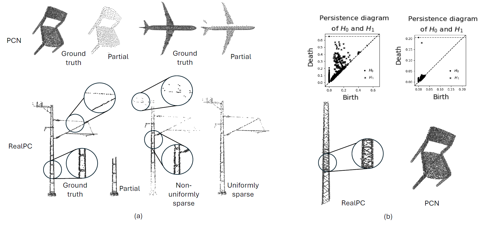

# Revisiting Point Cloud Completion: Are We Ready For The Real-World?[ICCV 2025]

Read our paper here:

## 🔍 Overview

Point clouds acquired in constrained, challenging, uncontrolled, and multi-sensor real-world settings are noisy, incomplete, and non-uniformly sparse. This presents acute challenges for the vital task of point cloud completion. Using tools from Algebraic Topology and Persistent Homology ($\mathcal{PH}$), we demonstrate that current benchmark object point clouds lack rich topological features that are integral part of point clouds captured in realistic environments. To facilitate research in this direction, we contribute the first real-world industrial dataset for point cloud completion, RealPC - a diverse, rich and varied set of point clouds. It consists of $\sim$ 40,000 pairs across 21 categories of industrial structures  in railway establishments. Benchmark results on several strong baselines reveal that existing methods fail in real-world scenarios. We discover a striking observation - unlike current datasets, \real{} consists of multiple 0- and 1-dimensional $\mathcal{PH}$-based topological features. We prove that integrating these topological priors into existing works helps improve completion. We present how 0-dimensional $\mathcal{PH}$ priors extract the global topology of a complete shape in the form of a 3D skeleton and assist a model in generating topologically consistent complete shapes. Since computing Homology is expensive, we present a simple, yet effective Homology Sampler guided network, BOSHNet that bypasses the Homology computation by sampling proxy backbones akin to 0-dim $\mathcal{PH}$. These backbones provide similar benefits of 0-dim $\mathcal{PH}$ right from the start of the training, unlike similar methods where accurate backbones are obtained only during later phases of the training.

## 📊 Dataset

We convert the individual .pcd files to paired Numpy arrays, hence obtaining two .npy files each (complete.npy and partial.npy) for the train and the test set. The RealPC dataset ($\sim$ 40,000 point cloud pairs) can be downloaded from here: 

We use a smaller subset of the dataset above for TopODGNet, which can be downloaded here:

